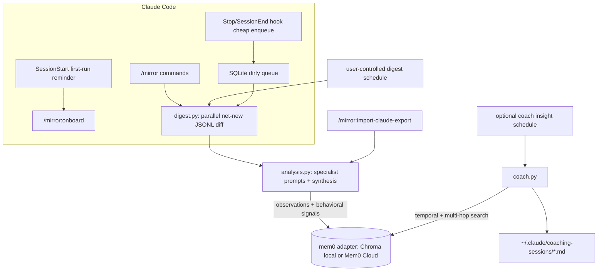
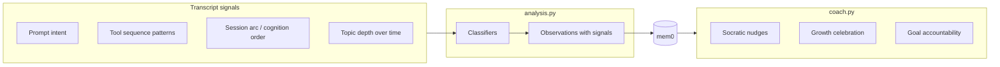
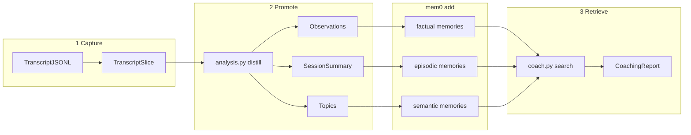
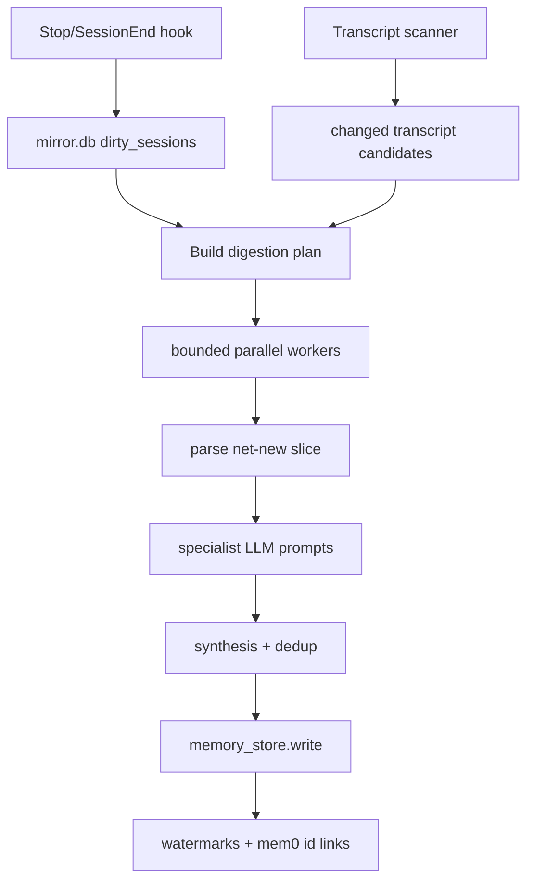
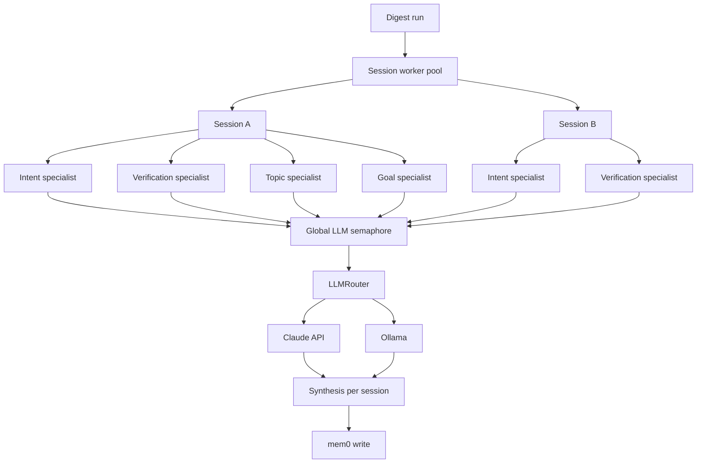

# Mirror

There is credible evidence that heavy AI use can subtly shift cognition from active problem-solving to passive verification, and for software engineers the main risk is losing the reps that build judgment, debugging skill, and deep mental models. Research on knowledge workers found that higher confidence in AI predicts less critical thinking, while higher self-confidence predicts more critical thinking; the cognitive effort shifts from generating and analyzing ideas to checking and integrating AI output. Anthropic’s coding-skill work found that developers using AI assistance scored worse on comprehension, with the biggest gap in debugging, which suggests faster task completion can come at the cost of learning the code deeply. A separate study on AI-assisted code generation also reported fewer self-initiated debugging strategies and more uncritical acceptance of AI suggestions.

The biggest hidden loss is incidental learning: the struggle that normally produces durable understanding. When AI gives the answer too quickly, you skip the stages where you form hypotheses, test alternatives, notice contradictions, and build a reusable mental model of the system. That means you may still ship code, but you learn less about why the code works, how systems fail, and how to recover when the tool is unavailable. In practice, that can hollow out architectural judgment, debugging fluency, and the ability to reason across unfamiliar codebases.

AI can also create a kind of cognitive offloading loop: the more you delegate, the less effortful thinking you practice, and the more dependent you become on the assistant for the next step. In software engineering, that matters because competence is not just producing code; it is recognizing bad code, spotting edge cases, and understanding tradeoffs under uncertainty. Over time, this can reduce confidence in your own reasoning, make debugging slower when AI is wrong, and encourage architecture choices based on what is easy to generate rather than what is robust.

Mirror is a local Claude Code plugin that coaches how you use AI. It reads Claude Code transcript JSONL files, distills coaching-relevant observations, and stores long-lived memories with mem0 using either local Chroma or an optional Mem0 Cloud account. Mirror looks for evidence of patterns like delegation-first debugging, low observable verification, repeated orientation questions, and topic-depth regression, then nudges you toward using AI as a sparring partner. The features/architecture of the plugin is inspired by studies from psychology and practices experts say help combat skill degradation:
- Think by hand first for a few minutes before asking AI, especially on design, debugging, and algorithms.
- Ask AI for hints, counterexamples, and critiques instead of full solutions.
- Verify outputs by tracing code, writing tests, and explaining the reasoning back in your own words.
- Reserve some work for “no-AI mode” so your retrieval, syntax recall, and debugging muscles keep getting exercised.
- Use AI more for acceleration after understanding, less for first-pass cognition.

## Architecture

### Core flow



### Signal detection → coaching



### Capture → promote → retrieve



### Parallel digestion



### Concurrency



## Install for development

```bash
python3 -m pip install --user uv
python3 -m uv sync --extra dev
```

Default local mode uses Chroma through OSS mem0. No `MEM0_API_KEY` is required unless you opt into Mem0 Cloud.

For Claude-backed analysis/coaching, persist your Anthropic API key so hooks and commands can see it:

```bash
echo 'export ANTHROPIC_API_KEY="sk-ant-..."' >> ~/.bashrc
source ~/.bashrc
```

Ollama can be used for any specialist or coach model:

```bash
export OLLAMA_BASE_URL="http://localhost:11434"
```

## Claude Code plugin commands

- `/mirror:onboard` — first-run setup and guidance.
- `/mirror:digest` — process new/changed transcripts into Mirror memories.
- `/mirror:coach` — generate an on-demand coaching report.
- `/mirror:goals list|add|edit|remove` — manage user goals.
- `/mirror:settings` — view/edit storage mode, specialist models, schedules, and output paths.
- `/mirror:schedule` — configure optional digestion or coach insight schedules.
- `/mirror:storage` — view/change `local_chroma` vs `mem0_cloud`.
- `/mirror:status` — show queue, settings, models, and goals.
- `/mirror:import-claude-export <path>` — import a Claude.ai data export.

## Data layout

- `${CLAUDE_PLUGIN_DATA}/mirror.db` — SQLite state: queue, watermarks, settings, goals, memory links.
- `${CLAUDE_PLUGIN_DATA}/chroma` — local Chroma persistence.
- `~/.claude/projects/**/*.jsonl` — Claude Code transcripts (source evidence only).
- `~/.claude/coaching-sessions/*.md` — optional saved coaching reports.

Raw transcripts are not written to mem0. Mirror stores distilled memories:

- factual observations about AI-use patterns,
- episodic session summaries,
- semantic topic/depth signals,
- factual user goals.

## Scheduling

Scheduling is always user-controlled.

- Digestion can be manual or scheduled.
- Coach insights are default off. If enabled, they write Markdown files to `~/.claude/coaching-sessions/` and do not interrupt active Claude Code sessions.

See `scheduler/` for cron and systemd examples.

## Model configuration

Every AI component goes through `LLMRouter` and can be configured independently:

- `prompt_intent`
- `verification_assimilation`
- `topic_depth`
- `goal_alignment`
- `memory_synthesis`
- `coach`

Each can use `claude/<model>` or `ollama/<model>`.

## Testing

```bash
python3 -m uv run --extra dev pytest -q
```

If the Claude CLI is installed:

```bash
claude plugin validate .
```
