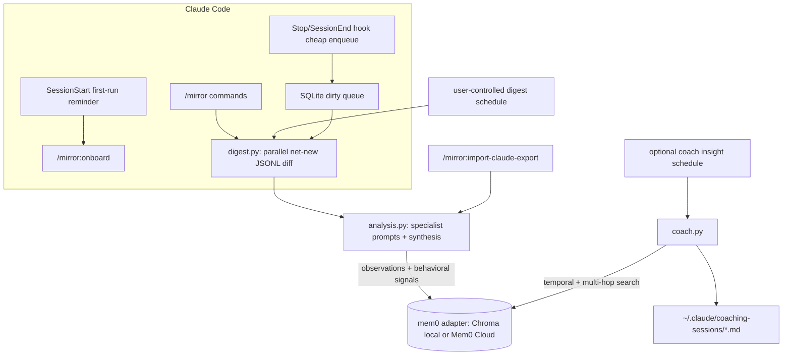
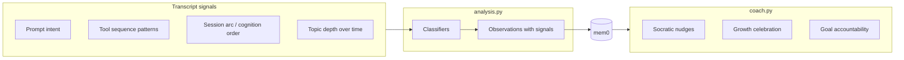
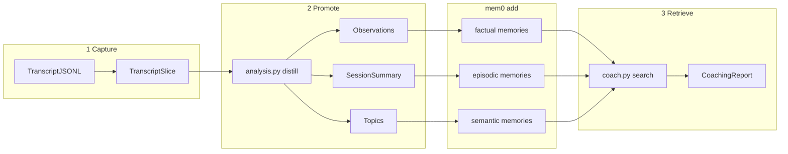
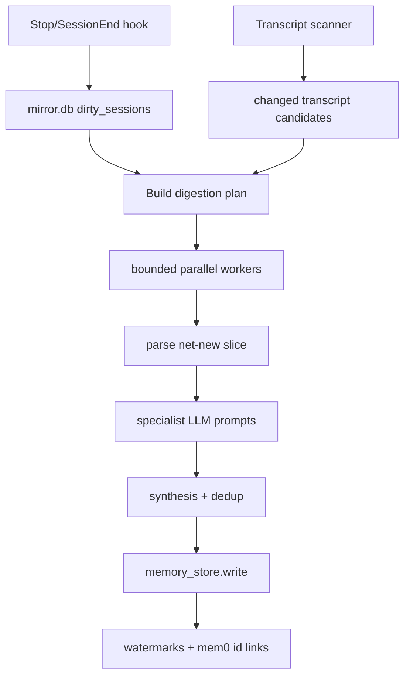
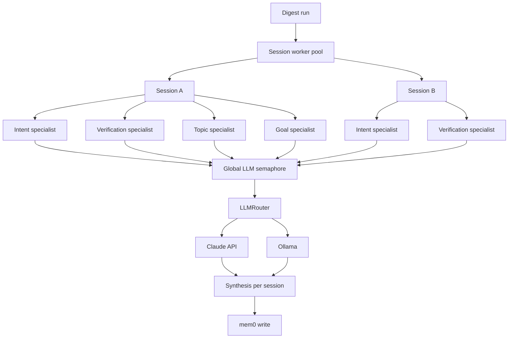

# Mirror

Mirror is a local Claude Code plugin that coaches how you use AI. It reads Claude Code transcript JSONL files, distills coaching-relevant observations, and stores long-lived memories with mem0 using either local Chroma or an optional Mem0 Cloud account.

The point is not shame. Mirror looks for evidence of patterns like delegation-first debugging, low observable verification, repeated orientation questions, and topic-depth regression, then nudges you toward using AI as a sparring partner.

## Architecture

### Core flow



### Signal detection → coaching



### Capture → promote → retrieve



### Parallel digestion



### Concurrency



## Install for development

```bash
python3 -m pip install --user uv
python3 -m uv sync --extra dev
```

Default local mode uses Chroma through OSS mem0. No `MEM0_API_KEY` is required unless you opt into Mem0 Cloud.

For Claude-backed analysis/coaching, persist your Anthropic API key so hooks and commands can see it:

```bash
echo 'export ANTHROPIC_API_KEY="sk-ant-..."' >> ~/.bashrc
source ~/.bashrc
```

Ollama can be used for any specialist or coach model:

```bash
export OLLAMA_BASE_URL="http://localhost:11434"
```

## Claude Code plugin commands

- `/mirror:onboard` — first-run setup and guidance.
- `/mirror:digest` — process new/changed transcripts into Mirror memories.
- `/mirror:coach` — generate an on-demand coaching report.
- `/mirror:goals list|add|edit|remove` — manage user goals.
- `/mirror:settings` — view/edit storage mode, specialist models, schedules, and output paths.
- `/mirror:schedule` — configure optional digestion or coach insight schedules.
- `/mirror:storage` — view/change `local_chroma` vs `mem0_cloud`.
- `/mirror:status` — show queue, settings, models, and goals.
- `/mirror:import-claude-export <path>` — import a Claude.ai data export.

## Data layout

- `${CLAUDE_PLUGIN_DATA}/mirror.db` — SQLite state: queue, watermarks, settings, goals, memory links.
- `${CLAUDE_PLUGIN_DATA}/chroma` — local Chroma persistence.
- `~/.claude/projects/**/*.jsonl` — Claude Code transcripts (source evidence only).
- `~/.claude/coaching-sessions/*.md` — optional saved coaching reports.

Raw transcripts are not written to mem0. Mirror stores distilled memories:

- factual observations about AI-use patterns,
- episodic session summaries,
- semantic topic/depth signals,
- factual user goals.

## Scheduling

Scheduling is always user-controlled.

- Digestion can be manual or scheduled.
- Coach insights are default off. If enabled, they write Markdown files to `~/.claude/coaching-sessions/` and do not interrupt active Claude Code sessions.

See `scheduler/` for cron and systemd examples.

## Model configuration

Every AI component goes through `LLMRouter` and can be configured independently:

- `prompt_intent`
- `verification_assimilation`
- `topic_depth`
- `goal_alignment`
- `memory_synthesis`
- `coach`

Each can use `claude/<model>` or `ollama/<model>`.

## Testing

```bash
python3 -m uv run --extra dev pytest -q
```

If the Claude CLI is installed:

```bash
claude plugin validate .
```
